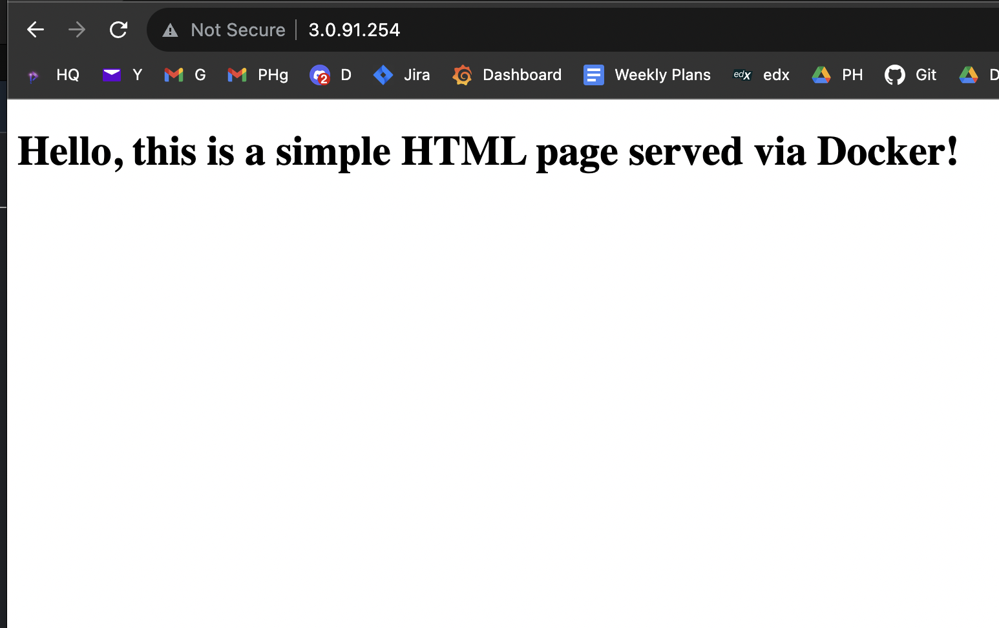

# Docker-101: Serve a Simple html app

## Here,
- We will install docker on an Amazon Linux Machine.
- Then we will build a docker image to serve a simple basic html page
- After that we will learn logging options to the DockerHub
- And we will push our image with version tag
- And finally see how we can pull versioned image from DockerHub and run

Sounds fun, right? Let's do it.

## 1.Install Docker on Linux Machine
I am using Amazon Linux2, you can use anything you want.

### 1.1.Update machine

```bash
sudo yum update
```

### 1.2.Install and setup docker

```bash
sudo yum install docker -y
docker --version
sudo yum install python3-pip
sudo pip3 install docker-compose
```

### 1.3.Enable docker service at AMI boot time

```bash
sudo systemctl enable docker.service
```

### 1.4.Start the Docker service: 

```bash
sudo systemctl start docker.service
```

#### Check status of docker service, if running or not 

```bash
sudo systemctl status docker.service
```

And if you wish to stop the service anyway

```bash
sudo systemctl stop docker.service
```


## 2.Dockerfile serve a basic html file
Create a file named: 'index.html' and paste the code from below -

```html
<!DOCTYPE html>
 <html>
  <body>
    <h1>Hello, this is a simple HTML page served via Docker!</h1>
  </body>
</html>
```


Create another file in the same folder/directory named: 'Dockerfile' (yes it does not have any extenstion, it is what it it.) and paste the lines from below - 

```dockerfile
# Use the official Nginx image as the base image
FROM nginx

# Copy the local index.html to the Nginx document root
COPY index.html /usr/share/nginx/html/

# Expose port 80 to allow external access
EXPOSE 80
```

### 2.1.Build Docker Image
So we are naming the server/app 'simple-server'

```
sudo docker build -t simple-server .
```

### 2.2.Run the built image

```
sudo docker run -d -p 80:80 simple-server
```


## 3.Push Pull Image on DockerHub

### 3.0.Create a DockerHub Account
Just go to [DockerHub](https://hub.docker.com/) to create an account, won't you?

Let's say your 
- username is **akbar**
- password is **1234**
- Access Toekn is **abcd**
### 3.1.Tag Image 
We will now tag, because in production we use tagging to keep a track of changes. Tag image using `username>/<repository>:<version_tag>`

```
sudo docker tag simple-server:v1.0 akbar/simple-server:v1.0
```

### 3.2.Login to DockerHub using CLI

#### 3.2.1. Login to DockerHub with username & password (**Not Recommended**)
It is not recommened because it exposes the password.. typing the password is not safe.

```
sudo docker login --username=akbar --password=1234
```

#### 3.2.2. Login to DockerHub with username & access_token 
Go to your profile and create an access_token. Select read, write delete permission based on your need. But recommened, exposes token.
```
sudo docker login -u akbar --password-stdin abcd
```

#### 3.2.3. Using echo to log in with access token and user name

Still not recommened, exposes token too.
```
echo "abcd" | sudo docker login --username=akbar --password-stdin
```

#### 3.2.4. Log in with access token in a file 
More secure, (**Recommended**)

```
sudo docker login --username=akbar --password-stdin < dockerhub_token.txt
```

### 3.3.Push Image
Push Image to dockerhub now after successful log in.

```
sudo docker push akbar/simple-server:v1.0
```

**Bam!! See the image on your dockerhub console..

### 3.4.Pull and Run

#### 3.4.1.PULL
Pull image from the DockerHub

```
sudo docker pull akbar/simple-server:v1.0
```

#### 3.4.2.Run
Pull and run

```
sudo docker run -p 80:80 akbar/simple-server:v1.0
```
Or, Run the pulled image (if it's already pulled, or stays in local storage)

```
sudo docker run -p 80:80 simple-server:v1.0
```

## 4. See result
Go to your localhost address or sever IP from a browser, as it is running on port 80, it will just show the result. Mine looks something like this. I know it's ugly, But it works, and that matters.



## Something to play with 

- check running instances: `sudo docker ps -asl`
- Pull images: `sudo docker pull imagename`


Remove all containers to free up some space.

> ashraf-minhaj was here